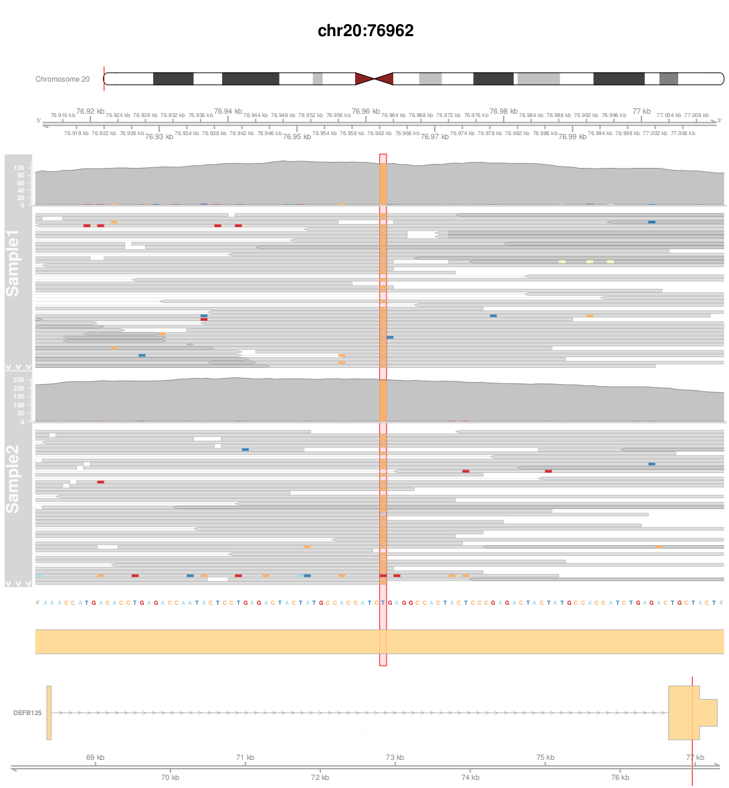

# Gviz_multiAlignments
R script for multiple BAM alignments viewing using Gviz (bioconductor package)

## Parameters

  * #### Mandatory
  
| Name | Default value | Description |
|-----------|--------------:|-------------|
| bam_folder    |            - | Folder containing all BAMs needed |
| pos_file | - |  File containing the position and samples to consider for the plot |
| ref | - |  A reference [fasta file](https://en.wikipedia.org/wiki/FASTA_format) |
| genome_release | - | Genome release needed for the annotations |

  * #### Optional

| Name | Default value | Description |
|-----------|--------------:|-------------|
| sample_names | FILE | Set this argument to "SAMPLE" if the input file contains the samples names extracted from the BAM files and not the BAM files names |

#### Example of an input file (pos_file argument)
| | | | |
|-----------|--------------|-------------|-----------|
| chr17 | 7572814	| SampleName1 or BAM_file1 |	 |
| chr17	| 7572814	| SampleName1 or BAM_file1	| SampleName2	or BAM_file2 |
| chr17	| 7579643	| SampleName1 or BAM_file1	| SampleName2	or BAM_file2 |

Using this input file, the R script will generate 3 pdf files, each pdf file containing the alignment of the BAM file(s) at each position.  

## Usage
```
Rscript script_gviz.r --pos_file=file_name.txt --bam_folder=/path_to_BAMs/ --ref=fasta_file.fa --genome_release=Hsapiens.UCSC.hg19 --sample_names=SAMPLE
```

## Detailed description

Bioconductor packages to install for plotting the alignments :

- The [Gviz](https://bioconductor.org/packages/release/bioc/html/Gviz.html) package
- An [Annotation package for TxDb objects](http://bioconductor.org/packages/release/BiocViews.html#___TxDb).
- A [Genome wide annotation](https://bioconductor.org/packages/release/BiocViews.html#___OrgDb), it contains mappings between Entrez Gene identifiers and GenBank accession numbers. Examples: the Genome wide annotation package for Human: *`org.Hs.eg.db`* and for the mouse: *`org.Mm.eg.db`*.

Example: If the hg19 release of the human genome is used, the following packages should be installed: *`Gviz`*, *`TxDb.Hsapiens.UCSC.hg19.knownGene`* (hg18 and hg38 UCSC version can also be used) and *`org.Hs.eg.db`*

These packages exist for other organisms than Human but have not been tested. One can for example generate the alignments plot for mouse data by installing *`TxDb.Mmusculus.UCSC.mm10.knownGene`* (mm9 UCSC version can also be used) and *`org.Mm.eg.db`*. For the other organisms the packages need to have the same nomenclature as the ones listed above.

The `--genome_release` option needs to be provided and corresponds to the TxDb annotation package name without its prefix and suffix. For the hg19 release of the human genome, one needs to set `--genome_release` to *`Hsapiens.UCSC.hg19`*.
Note that the packages chosen for the annotations are compatible with the UCSC notations since most of the Gviz fonctionalities can handle these notations. The reference genome used for the BAM alignments can be based on GENCODE, UCSC or ENSEMBL genome varieties.




#### The alignment plot from top to bottom :

- Chromosome representation : a red vertical line shows the position of the variant
- Genomic axis associated with the alignment.
- BAM alignment(s) (50 bases on both sides of the variant) : the variant position is highlighted in red.
- The reference genome : the variant position is highlighted in red.
- Genome annotation : the yellow blocks represent exons, the variant position is highlighted in red. The annotation is represented only if the variant is not in an intergenic region.
- Zoom-out on the genome annotation : representation of the whole gene whose name is on the right side of the gene annotation. The annotation is represented only if the variant is not in an intergenic region. A red vertical line shows the position of the variant. 
- Genomic axis corresponding to the previous genome annotation. A red vertical line shows the position of the variant. 
